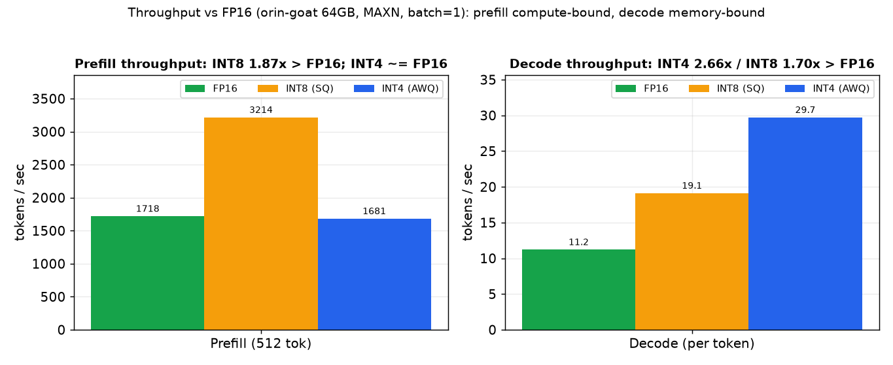
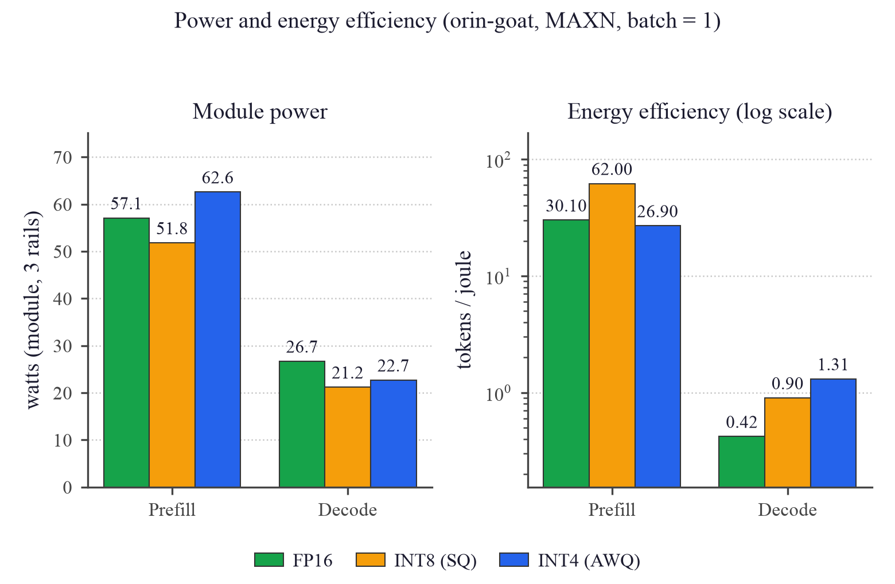
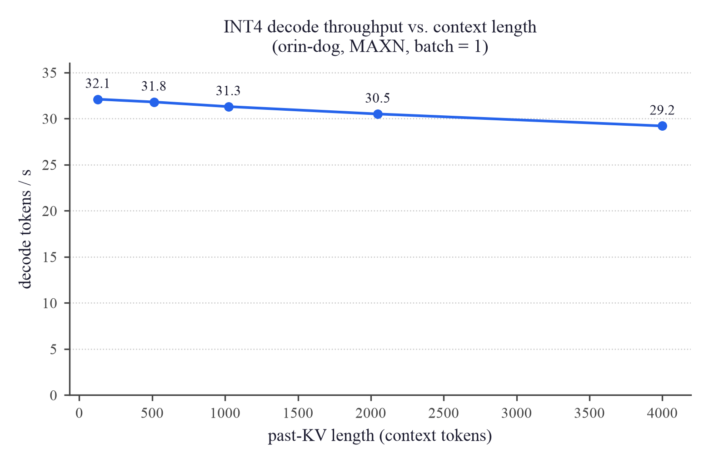
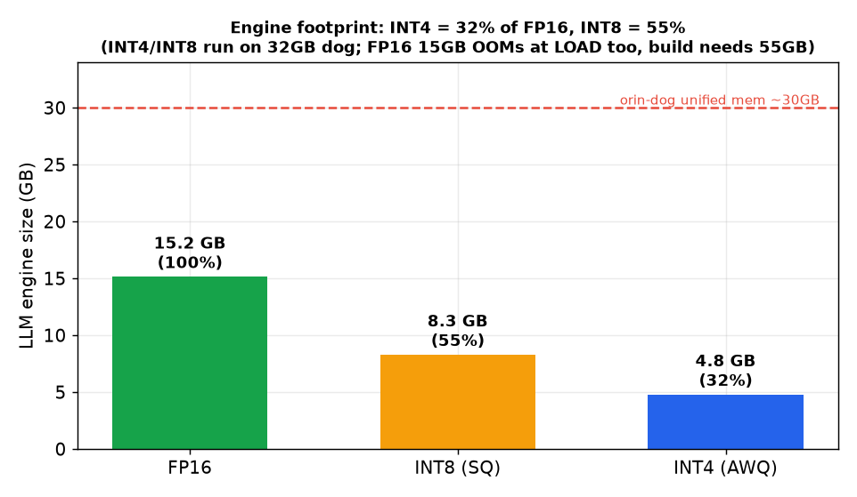
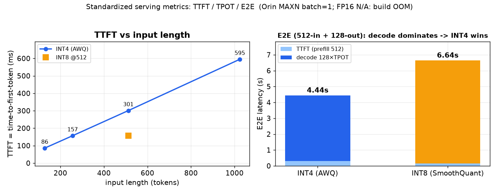
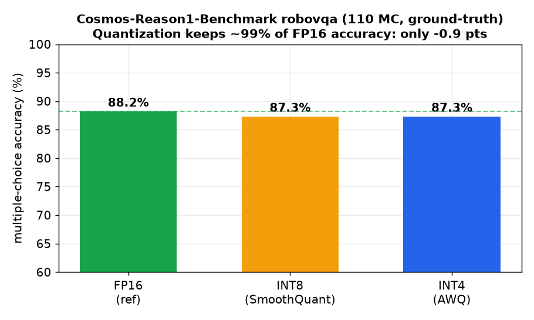
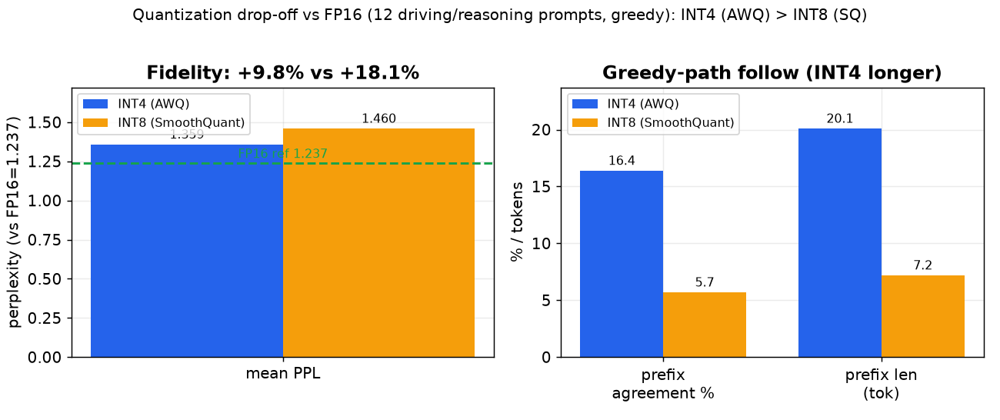
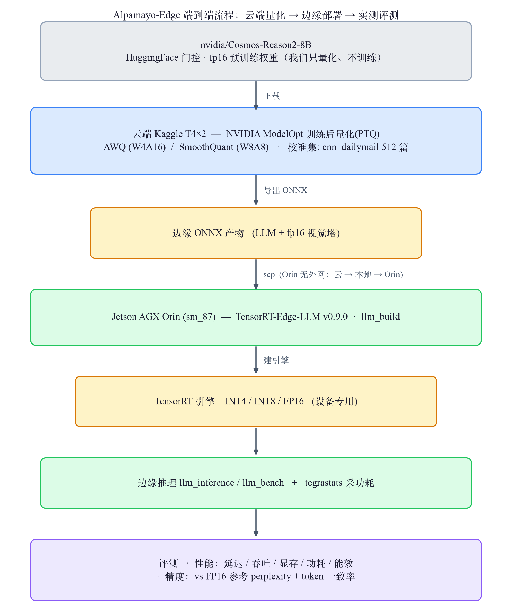

# M5 — 项目总结报告（论文式 · 可展示版）

> 结构：摘要 → 核心结果 → 方法细节（可复现）→ 思考讨论。
> 详细指标 [edge_deploy_status.md](edge_deploy_status.md)｜方法与校准 [METHODOLOGY.md](METHODOLOGY.md)｜**问题记录（含 FMHA 根因）[PROBLEMS.md](PROBLEMS.md)**｜目标对照 [plan.md](plan.md)。

## 摘要

把 NVIDIA **Cosmos-Reason2-8B**（自动驾驶物理场景推理多模态大模型，属"感知+推理/可解释"层，**不是**轨迹预测器）用 **TensorRT-Edge-LLM** 量化为 **INT4 (AWQ)** 与 **INT8 (SmoothQuant)**，部署到 **Jetson Orin (sm_87)**，端到端跑通引擎构建→加载→prefill→decode→真实文本/图像推理，测出延迟/吞吐/显存/功耗/能效完整画像 + 用 FP16 参考量化掉点。**核心结论：decode 看 INT4、prefill 看 INT8；INT4 在本工作负载既更快（decode 1.57×）又更保真（掉点 +9.8% vs INT8 +18.1%）。** 零预算 · 零训练 · 全 Orin。

- **输入**：图像/视频帧 + 文字问题；**输出**：文字推理（场景描述/风险判断/行动建议），非轨迹路点。

## 一、核心结果

> **横轴**：Prefill(512 token 输入) / Decode(每 token) 两阶段 **竖轴**：吞吐(tokens/秒) **结果**：prefill INT8 快 1.9×；decode INT4 快 1.57× **分析**：prefill 计算密集→INT8 原生张量核占优；decode 访存密集(每步搬全部权重)→INT4 权重小更快 ⇒ 交互式选 INT4、批量选 INT8

> **横轴**：Prefill / Decode 两阶段（两子图同） **竖轴**：左=整机功耗(瓦，三电轨之和)，右=能效(tokens/焦耳，对数轴) **结果**：INT8 prefill 能效高 2.3×，INT4 decode 能效高 1.64× **分析**：能效=吞吐÷功耗，各阶段吞吐赢家功耗还不劣；边缘设备电/热受限，能效常比绝对速度更关键

> **横轴**：上下文长度(past-KV token 数，128→4000) **竖轴**：INT4 decode 吞吐(tokens/秒) **结果**：上下文涨 31× 吞吐仅降 9% **分析**：decode 延迟由权重搬运主导、注意力占比小，故长上下文几乎不掉速 ⇒ 适合长对话/长文档

> **横轴**：三类产物(Orin LLM 引擎 / 打包 tgz / 载入显存) **竖轴**：体积(GB) **结果**：INT4 比 INT8 约省 42% **分析**：LLM 主干 INT8≈INT4 的 1.7×(近 W8A8 vs W4A16 理论 2×，差在共享 fp16 词嵌入/视觉塔)；省下的显存可留给更长 KV cache 或多模型并存

> **横轴**：左=输入长度(token)，右=精度 **竖轴**：左=TTFT(ms)，右=E2E(s，prefill+decode 堆叠) **结果**：TTFT 随输入近线性(INT4 86→595ms@128→1024)；512-in+128-out E2E INT4 4.44s < INT8 6.64s **分析**：生成越长 decode(TPOT) 越主导 → INT4 的 E2E 更优；FP16 因 OOM 无设备端数据

> **横轴**：三种精度(FP16/INT8/INT4) **竖轴**：真实基准 MC 任务正确率 %(绿虚线=FP16 88.2%) **结果**：FP16 88.2%、INT8/INT4 均 87.3%（−0.9 pts，误差棒=Wilson 95%CI） **分析**：CI 大幅重叠、McNemar p=1.0 → 差异**统计不显著**(n=110)，稳妥结论=**量化无显著任务正确率损失**。**另:FP16 引擎在 Orin build 期 OOM(16GB>29GB)→ 量化是部署必需**。

> （辅助/细粒度）**横轴**：左=平均 perplexity，右=与 FP16 的一致性(一致前缀占比 % / 长度 token) **竖轴**：左=perplexity(越低越贴近 FP16，虚线=FP16 基线 1.237)，右=百分比 / token 数 **结果**：INT4 掉点 +9.8% 小于 INT8 +18.1% **分析**：INT4(W4A16 纯权重、激活留 16bit)对校准域错配更鲁棒，INT8(W8A8)连激活量化更敏感 → 掉点更大；本负载 INT4 既快又保真

| 场景 | 选 | 理由（实测） |
|---|---|---|
| 交互式 / 单流低延迟 / 省电 / 精度敏感 | **INT4** | decode 30.9 TPS（高 57%）、能效 0.82 tok/J（高 64%）、显存 ~4.6GB（省 42%）、掉点 +9.8% |
| 批量 / 长上下文 / 高吞吐 | **INT8** | prefill 3252 TPS（快 1.9×）、能效 62.8 tok/J（高 2.3×）、功耗更低（掉点 +18.1%） |

（环境：Orin sm_87 / JetPack 6 / CUDA 12.6 / TRT 10.7 / MAXN；batch=1，prefill 512 tok，decode pastKV=512。sweep：decode 上下文涨 31× 仅掉 9%；多模态图像路径端到端验证正确。）

## 二、方法细节（可复现）

### 2.1 方法总览（端到端流程 · 为什么这么设计）

**描述**：预训练权重在云端一次性量化并导出 ONNX，传到 Orin 编译成设备专用 TensorRT 引擎，再在边缘实测性能与精度两轴。
**为什么这么设计**：① 8B(16GB)本地 3070(8GB)装不下、Orin 无外网 → 量化这类一次性重活放免费云 T4×2；② 以 ONNX 作跨平台中间表示，云端导出与边缘建引擎解耦；③ TensorRT 引擎按 GPU 架构(sm_87)特化，必须在目标设备本地构建；④ 生成式 VLM 无标注任务集 → 精度用 FP16 参考的相对退化，与性能轴分离。

### 2.2 方法细节（配置与口径）

- **模型/权重**：`nvidia/Cosmos-Reason2-8B`（HF 门控，NVIDIA 预训练；**只量化不训练**）。36 层·hidden 4096·GQA 32/8·RoPE 262144·vocab 151936。
- **量化**：ModelOpt PTQ。INT4=AWQ(W4A16)、INT8=SmoothQuant(W8A8)。**校准集 = 默认 512 篇 CNN/DailyMail 新闻文本（非驾驶域，重要 caveat）**；视觉塔未量化保 fp16。
- **数据**：精度 = 12 条手写 prompt（无标注、非 benchmark）；性能 = llm_bench 合成序列。
- **指标**：延迟/吞吐 = llm_bench E2E（mean±std, warmup3+iter10）；功耗 = tegrastats 三轨和；能效 = TPS÷W；掉点 = FP16 模型 teacher-forced perplexity + token 一致率。
- 完整定义、命令、校准影响分析见 **[METHODOLOGY.md](METHODOLOGY.md)**。

## 三、思考讨论

- **INT8 vs INT4 与校准集消融**：perplexity 上 INT4(W4A16) 略优于 INT8(W8A8，连激活量化、对校准更敏感)。**做了校准集消融推翻直觉假设**：用域内小校准集重量化 INT8 反而暴跌（ppl +244%、MC 84.5%）→ **校准集覆盖度/质量比"域匹配"更关键**，默认 news-512 得验证（消融含域/规模 confound）。见 `eval/accuracy/ablation_calibration/`。
- **能用来干什么**：① 可复用的边缘量化部署方法论（沉淀为 skill `edge-quantize-deploy`）；② 可实时查询的车载场景推理系统（~30 TPS @ ~40W）；③ 完整 INT4-vs-INT8 边缘权衡实证。
- **诚实的边界**：① 无轨迹预测（VLA 轨道暂缓）；② 精度为相对退化口径（"量化+引擎+后端"总差距，非纯量化误差、非任务正确率）；③ 校准集非驾驶域；④ 量化标的由 Alpamayo 改 Cosmos（Alpamayo 只支持 FP16 不能量化）。
- 实验全过程的问题/根因/解决（含 FMHA 崩溃跨层根因）见 **[PROBLEMS.md](PROBLEMS.md)**。

## 简历 bullet（实测数）

- 用 NVIDIA TensorRT-Edge-LLM 将 8B 多模态大模型 (Cosmos-Reason2) 量化为 INT4/INT8 并部署至 Jetson Orin，
  实测标准服务指标 **INT4 decode 30.9 TPS / TTFT 301ms @ ~40W**、**INT8 prefill 3252 TPS**；在**官方 Cosmos-Reason1-Benchmark**
  上量化**无显著任务正确率损失**(88.2%→87.3%，−0.9pts，McNemar p=1.0)；并发现 **FP16(16GB) 在 Orin OOM 无法部署→量化是落地必需**。
- 定位并修复 sm_87 上的 FMHA kernel 派发崩溃：从崩溃断言追到 CMake 构建配置（漏传 Orin target flag
  致 sm_87 kernel 被编译排除），非平凡的跨层（运行时 kernel 表 ↔ 编译宏 ↔ CMake）根因排查。
- 建立 INT4/INT8 在延迟/吞吐/显存/功耗/能效/上下文扩展性/量化掉点的完整边缘画像，沉淀为可复用部署工作流。

> Resume (EN): *Quantized an 8B multimodal VLM (Cosmos-Reason2) to INT4/INT8 with NVIDIA
> TensorRT-Edge-LLM and deployed it to Jetson Orin; measured the full latency/throughput/memory/
> power/energy tradeoff (INT4 decode 30.9 TPS @ ~40W; INT8 prefill 3252 TPS) and quantization
> drop-off vs an FP16 reference (INT4 perplexity +9.8% vs INT8 +18.1%), and root-caused a hard
> sm_87 FMHA kernel-dispatch crash down to a missing CMake target flag.*
